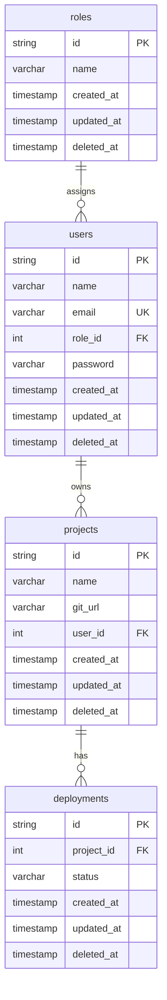

# Data Modelling — Tables and ER Diagram

This section outlines the database schema used in the project, detailing each table, its fields, and their use cases. The schema is implemented using Prisma ORM with a PostgreSQL datasource.

---

## User Table

| Field | Type | Constraints | Description / Use Case |
|-------|------|--------------|-------------------------|
| `id` | string(UUID) | Primary Key | Unique identifier for each user. |
| `name` | varchar|  | not null |User’s full name for display. |
| `email` | varchar| Unique, Indexed | Used for authentication and identification. |
| `role_id` | int | User and Admin Role |
| `password` | varchar|  | Securely stored hashed password. |
| `created_at` | timestamp | Default: now() | Timestamp when the user was created. |
| `updated_at` | timestamp | | Timestamp for last update. |
| `deleted_at` | timestamp |  null |Timestamp for last delete. |

---

## Project Table

| Field | Type | Constraints | Description / Use Case |
|-------|------|--------------|-------------------------|
| `id` | string(UUID) | Primary Key | Unique project identifier. |
| `name` | varchar|  | Project name displayed in UI. |
| `git_url` | varchar| Indexed | GitHub repository URL linked to the project. |
| `user_id` | int | Foreign Key → `User.id` | Identifies the owner of the project. |
| `created_at` |timestamp | Default: now() | Project creation timestamp. |
| `github_token` | varchar |  | Hashed token for GitHub integration, allowing deployments via repositories. |
| `updated_at` | timestamp| | Timestamp for last |
| `deleted_at` | timestamp |  null |Timestamp for last delete. |

---

## Deployment Table

| Field | Type | Constraints | Description / Use Case |
|-------|------|--------------|-------------------------|
| `id` | string(UUID) | Primary Key | Unique deployment identifier. |
| `project_id` | int | Foreign Key → `Project.id` | Identifies the project this deployment belongs to. |
| `status` | varchar| Indexed, Default: `QUEUED` | Deployment lifecycle state (`QUEUED`, `RUNNING`, `COMPLETED`, `FAILED`). |
| `created_at` |timestamp | Default: now() | Timestamp of deployment creation. |
| `updated_at` |timestamp | | Timestamp for last |
| `deleted_at` | timestamp | null |Timestamp for last delete. |

---

## Role Table

| Field | Type | Constraints | Description / Use Case |
|-------|------|--------------|-------------------------|
| `id` | string(UUID) | Primary Key | role identifier. |
| `name` | varchar| UK |Eg. USER, ADMIN |
| `created_at` |timestamp | Default: now() | Timestamp of deployment creation. |
| `updated_at` |timestamp | | Timestamp for last updadeleted_at |Timestamp |null | Timestamp for last delete. |
| `deleted_at` | timestamp |  null |Timestamp for last delete. |

## Relationships Summary

- **User → Project**: One-to-Many (a user can own multiple projects).
- **Project → Deployment**: One-to-Many (a project can have multiple deployments).

---

## Entity Relationship Diagram
