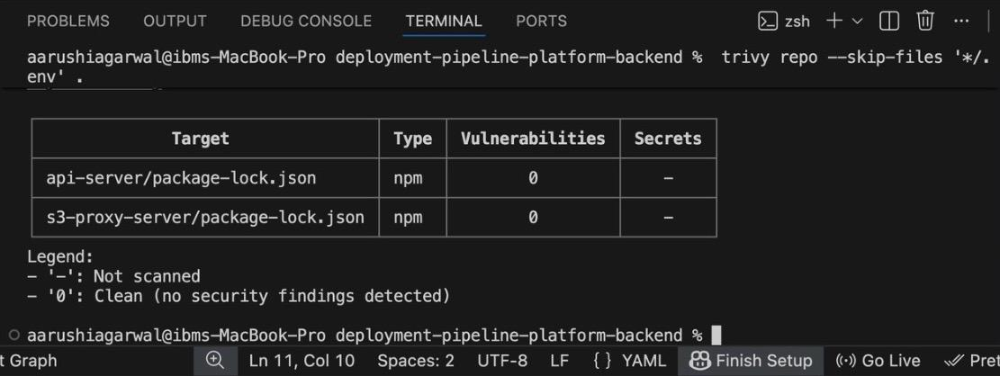
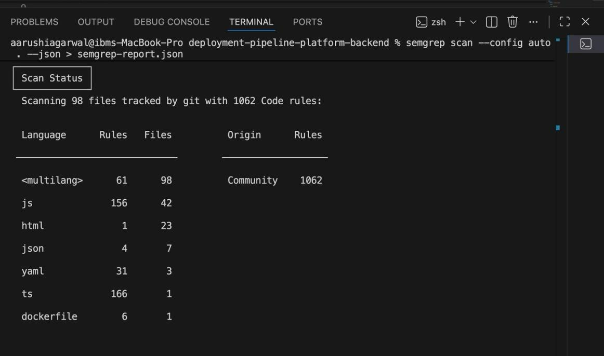

# Security Scanning

This project follows DevSecOps best practices by performing **multiple layers of security scanning** during development and before deployment.

Tools used:

- **Trivy** → *SCA (Software Composition Analysis)*
- **Semgrep** → *SAST (Static Application Security Testing)*

---

## Why Security Scanning?

Security scanning ensures:

- Early detection of vulnerabilities  
- Secure dependency management  
- No high-risk packages reach production  
- Coding-level security issues are caught early  
- Safe deployment to EC2 and cloud environments  
- Compliance with DevSecOps & CI/CD standards  

---

# Tools Used

---

## 1. **Trivy — Vulnerability & Dependency Scanning (SCA)**  

Trivy scans project dependencies, build artifacts, and the filesystem to detect vulnerabilities, misconfigurations, and exposed secrets.

### **Used to Scan:**
- Backend servers  
- Frontend build artifacts  
- `node_modules`  
- Docker images (if applicable)  
- Entire project folder  
- Secrets and configuration issues  

### **Trivy Scan Output**

---

## 2. **Semgrep — Static Code Analysis (SAST)**  

Semgrep scans application **source code** to detect insecure coding patterns, logic flaws, and violations of security best practices.  
It helps developers catch issues early without running the application.

### **Used to Scan:**
- Backend Node.js source code  
- Frontend React/Vite source code  
- API route handlers & controllers  
- Authentication & authorization logic  
- Input validation and sanitization  
- Hardcoded secrets in code  
- Insecure functions or unsafe patterns  
- OWASP Top 10 categories (Injection, XSS, Access Control, etc.)  

### **Semgrep Scan Output**

---

# Summary

| Tool        | Scan Type | Purpose |
|-------------|-----------|---------|
| **Trivy**   | SCA       | Scans dependencies, build artifacts & filesystem for vulnerabilities |
| **Semgrep** | SAST      | Performs static analysis to find security issues in source code |

---

