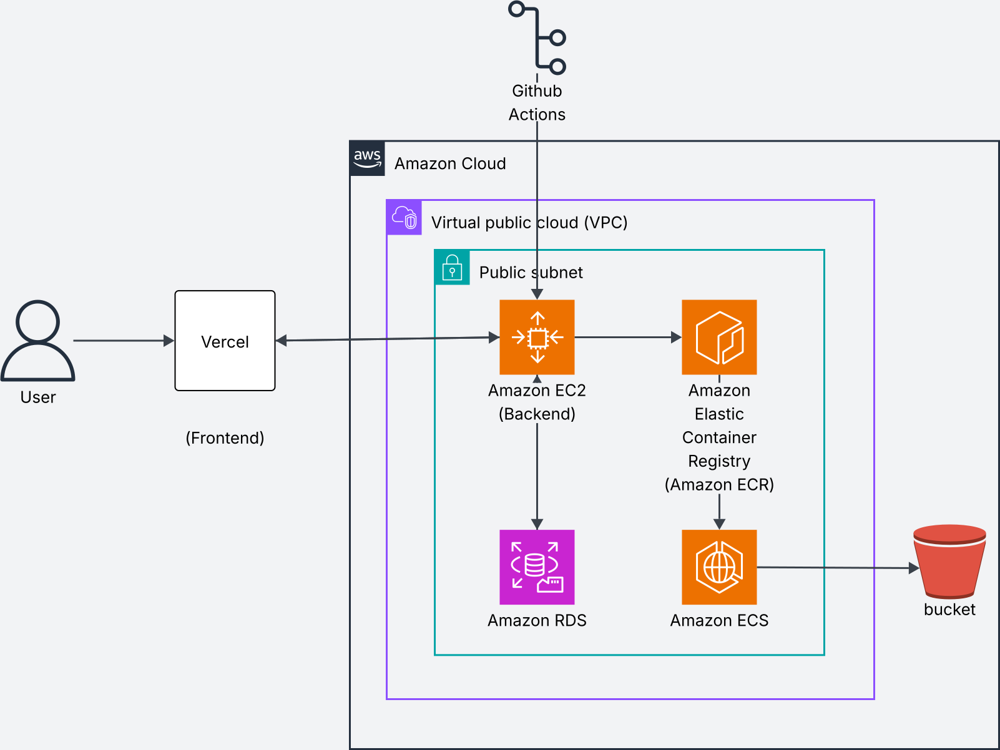

# AWS Infrastructure Architecture

## Overview
This document describes the complete AWS infrastructure setup for the project, including all cloud services and their interactions.

---

## Infrastructure Diagram

---

## Vercel

Use vercel for deployment of frontend.

## AWS Services

### Core Services Used

1. **Amazon VPC (Virtual Private Cloud)**
2. **Amazon EC2 (Elastic Compute Cloud)**
3. **Amazon RDS (Relational Database Service)**
4. **Amazon ECR (Elastic Container Registry)**
5. **Amazon ECS (Elastic Container Service)**
6. **Amazon S3 (Simple Storage Service)**

---

## Network Architecture

### Virtual Public Cloud (VPC)

The entire infrastructure is contained within an AWS VPC, providing network isolation and security.

### Public Subnet

Contains publicly accessible resources:
- **Amazon EC2 (Backend)**: Application server
- **Amazon ECS**: Container orchestration service

#### Public Subnet Components

**Amazon EC2 (Backend)**
- Hosts the backend application
- Publicly accessible via internet
- Connects to Amazon RDS for data persistence

**Amazon ECS**
- Container orchestration platform
- Pulls images from Amazon ECR
- Connects to S3 bucket for storage operations

---

## Service Components

### Compute Layer

#### Amazon EC2 (Backend)
- **Purpose**: Hosts backend application server
- **Network**: Public subnet
- **Connections**: 
  - Downstream: Amazon RDS
  - Upstream: User requests

#### Amazon ECS (Elastic Container Service)
- **Purpose**: Container orchestration and management
- **Network**: Public subnet
- **Connections**:
  - Upstream: Amazon ECR (pulls container images)
  - Downstream: S3 bucket (stores outputs)

### Container Registry

#### Amazon ECR (Elastic Container Registry)
- **Purpose**: Stores Docker container images
- **Access**: ECS pulls images for deployment
- **Integration**: Part of the CI/CD pipeline

### Database Layer

#### Amazon RDS (Relational Database Service)
- **Purpose**: Persistent data storage
- **Network**: Within public subnet
- **Access**: Connected to EC2 backend
- **Security**: Database credentials secured

### Storage Layer

#### S3 Bucket
- **Purpose**: Object storage for application outputs
- **Access**: Connected to Amazon ECS
- **Use Cases**:
  - Build artifacts storage
  - Static asset hosting
  - Application outputs
  - Project files

---

