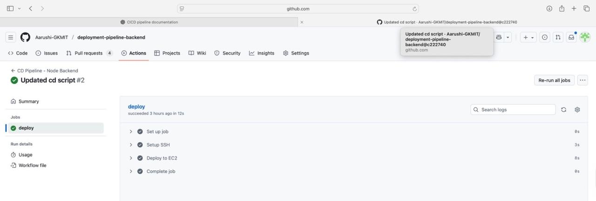
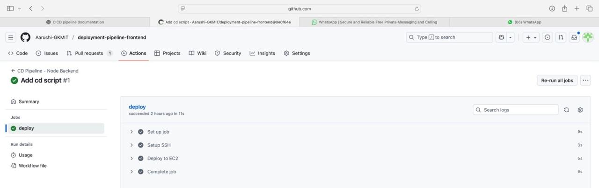

# CI/CD Pipeline and Deployment Flow

This document explains the complete Continuous Integration / Continuous Deployment (CI/CD) pipeline along with the end-to-end deployment flow for both the frontend and backend services deployed on Amazon EC2. The system uses GitHub Actions for automation, PM2 for process management, Aiven for PostgreSQL, and Route 53 for DNS routing.

---

## 1. Branch Strategy

The project follows a branch-based development approach. CI/CD pipelines run only for specific branches.

### **Frontend Branches**
- `feature/admin-dashboard`
- `feature/ci-cd`

### **Backend Branches**
- `feature/route53`
- `feature/ci-cd`

A push to any of the above branches triggers the corresponding CI/CD pipeline.

---

## 2. CI/CD Pipeline Overview

The CI/CD process consists of the following stages:

### **2.1 Continuous Integration**
Triggered when code is pushed to designated branches.

Performed steps:
- Checkout repository  
- Install Node.js  
- Install dependencies  
- Run unit tests (if any)  
- Build frontend or backend depending on the workflow  
- Prepare final build artifacts  

Build failures stop the pipeline immediately and prevent unsafe deployments.

---

### **2.2 Artifact Packaging**
After a successful build:

**Frontend**
- A production build (`dist/`) is generated.

**Backend**
- Required backend services (API Server, Build Server, S3 Proxy Server) are prepared into a deployable folder.

---

### **2.3 Secure Transfer to EC2**
Build artifacts are transferred to EC2 using SCP from GitHub Actions:

- GitHub Secrets store the SSH key  
- Only the required files are copied  
- No manual intervention needed  

---

### **2.4 Remote Deployment via SSH**
GitHub Actions remotely connects to EC2 using SSH and performs:

- Install Node.js dependencies  
- Replace old build files  
- Restart services via PM2  

Backend services restarted:
```bash
pm2 restart api-server
pm2 restart build-server
pm2 restart s3-proxy-server

```
## CI/CD Pipeline for Backend Deployment
 


## CI/CD Pipeline for Frontend Deployment



