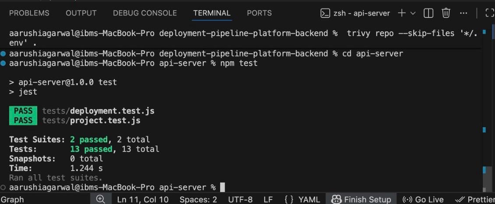

# Unit Test Plan – Deployment Pipeline Platform

## 1. Introduction

This document explains the unit testing plan for the Deployment Pipeline Platform project.
It covers both the frontend (React) and backend (Node.js/Express + Prisma).
The main goal is to ensure each part of the system works correctly before deployment and that critical functionalities are thoroughly tested.

---

## 2. Objective

The main objectives of unit testing are to:

* Verify that every function, component, and service performs as expected.
* Detect and fix bugs early in development.
* Maintain clean, stable, and maintainable code.
* Ensure new updates do not break existing features.
* Maintain test coverage targets for critical modules.

---

## 3. Scope

### Included

* **Frontend:** React components, hooks, API services, and utility functions.
* **Backend:** Controllers, services, utils, Prisma logic, and database interactions.

### Excluded

* End-to-end testing (handled in separate e2e plan)
* Integration with third-party services (except for mocks)

---

## 4. Test Architecture / Folder Structure

Organize tests in a **clear folder structure**:

```
frontend/
 ├─ src/
 │   ├─ components/
 │   │   └─ __tests__/
 │   ├─ hooks/
 │   │   └─ __tests__/
 │   └─ services/
 │       └─ __tests__/

backend/
 ├─ src/
 │   ├─ controllers/
 │   │   └─ __tests__/
 │   ├─ services/
 │   │   └─ __tests__/
 │   ├─ utils/
 │   │   └─ __tests__/
 │   └─ prisma/
 │       └─ __tests__/
```

---

## 5. Test Approach

We will use **Jest** as the main testing framework, with additional tools for frontend and backend.

### Frontend

* **Tools:** Jest + React Testing Library
* **Focus Areas:**

  * Component rendering and behavior
  * Form validation and API calls (mocked)
  * Hooks and utility functions
  * Negative test cases (e.g., invalid input, API errors)

### Backend

* **Tools:** Jest + Supertest + Prisma Test Client
* **Focus Areas:**

  * Controller routes and API responses
  * Business logic in services
  * Utility functions (validation, formatting, etc.)
  * Mocked database and external services
  * Negative test cases (e.g., invalid input, duplicate records, failed DB calls)

### CI/CD Integration

* All tests are run automatically via **GitHub Actions** in the CI/CD pipeline.
* **Pipeline will fail** if critical tests fail or coverage is below the target.
* Coverage reports will be generated for every pull request.

---

## 6. Coverage Targets

* Maintain **≥ 70–80% coverage** for all critical frontend and backend modules.
* Coverage thresholds will be enforced via CI/CD.
* Reports generated using:

```bash
npm run test:coverage
```

---

## 7. Test Cases (Examples)

### Frontend

| Module           | Test Case                  | Expected Result                        |
| ---------------- | -------------------------- | -------------------------------------- |
| Login Component  | Valid credentials          | Redirects to dashboard                 |
| Login Component  | Invalid credentials        | Shows error message                    |
| Signup Component | Invalid email              | Shows validation error                 |
| Signup Component | Duplicate email            | Shows conflict error                   |
| useAuth Hook     | Logout                     | Clears token and redirects             |
| API Service      | Fetch project list         | Returns mocked data successfully       |
| Project Form     | Submit with missing fields | Shows validation error (negative case) |

### Backend

| Module          | Test Case                         | Expected Result                         |
| --------------- | --------------------------------- | --------------------------------------- |
| AuthController  | Register user                     | Returns 201 with user data              |
| AuthController  | Register duplicate user           | Returns 409 Conflict                    |
| AuthService     | Generate JWT token                | Returns valid token                     |
| PipelineService | Create pipeline                   | Returns success response                |
| PipelineService | Create pipeline with invalid data | Returns 400 Bad Request (negative case) |
| Utils           | Validate email function           | Returns true/false correctly            |
| Database        | Prisma create user                | Successfully persists user              |
| Database        | Prisma create duplicate user      | Throws error (negative case)            |

---

## 8. Test Schedule

| Activity                       | Responsible      | Timeframe                       |
| ------------------------------ | ---------------- | ------------------------------- |
| Write unit test cases          | Myself           | During development              |
| Execute tests locally          | Myself           | Before each commit or push      |
| Fix and retest                 | Myself           | Immediately after test failures |
| Final test review              | Mentors          | Before deployment or submission |
| CI/CD Integration Verification | Myself / Mentors | During development & PR         |

---

## 9. Responsibility

I am responsible for writing, running, and maintaining all unit tests for both frontend and backend.
Mentors will review final results, verify coverage, and approve before deployment.

---

## 10. Risks

| Risk                                        | Impact | Mitigation                                                   |
| ------------------------------------------- | ------ | ------------------------------------------------------------ |
| Limited time for writing tests              | Medium | Write tests alongside coding                                 |
| Low coverage                                | Medium | Track coverage reports regularly; enforce minimum thresholds |
| Mocking external APIs incorrectly           | High   | Use proper mocking libraries; review mocks regularly         |
| Skipped updates to tests after code changes | Medium | Update tests concurrently with feature changes               |

---

## 11. Tools

| Tool                  | Purpose                                  |
| --------------------- | ---------------------------------------- |
| Jest                  | Testing framework for frontend & backend |
| React Testing Library | Testing React components                 |
| Supertest             | Testing backend routes                   |
| Prisma Test Client    | Mocking Prisma DB calls                  |
| ESLint / Prettier     | Code formatting and linting              |
| GitHub Actions        | CI/CD to run tests and enforce coverage  |

---

## 12. Commands

```bash
# Run all tests
npm run test

# Run tests with coverage report
npm run test:coverage
```


## Test Execution




## Code Coverage


